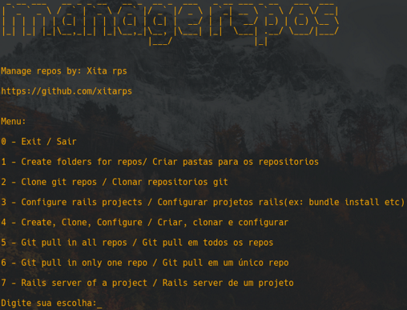

# Manage_repos

This little script is meant to make easy to download and configure rails repos.
ex: If you have to review some candidates codes for a job select process(make directories,git clone, bundle install and stuff).
So you can make this task easier.

Este pequeno script foi criado para facilitar o download e a configuração dos repositórios do Rails.
ex: se você tiver que revisar alguns códigos de candidatos para um processo de seleção de trabalho (criar diretórios, git clone, bundle install e outras coisas).
Portanto, você pode tornar essa tarefa mais fácil.

* obs: Depends on rvm, also repositories ruby versions must be already installed (ex: rvm install 3.0.0)
* obs: Depende do rvm, também as versões do ruby ​​dos repositórios devem estar instaladas (ex: rvm install 3.0.0)

[Need help to install rvm?](https://rvm.io/rvm/install)

[Precisa de ajuda para instalar o rvm?](https://rvm.io/rvm/install)

## How To Use / Como utilizar

```
    $ git clone https://github.com/xitarps/manage_repos
```
```
    $ cd ./manage_repos
```
```
    # sudo chmod +x ./manage_repos.sh
```
```
 - Fill the list with repos (./repo_list.txt)
 - Preencha a lista com os repositorios desejados(./repo_list.txt)
 ```
 ```
 - Each line is an entry 
 - Cada linha é um repositorio
 ```
 
 Run / Execute:
 ```
    $ ./manage_repos
 ```
 
 - Then follow the instructions of the terminal(as your's needs asks)
 - Em seguida, siga as instruções do terminal (conforme suas necessidades pedirem)

### Screenshot:

